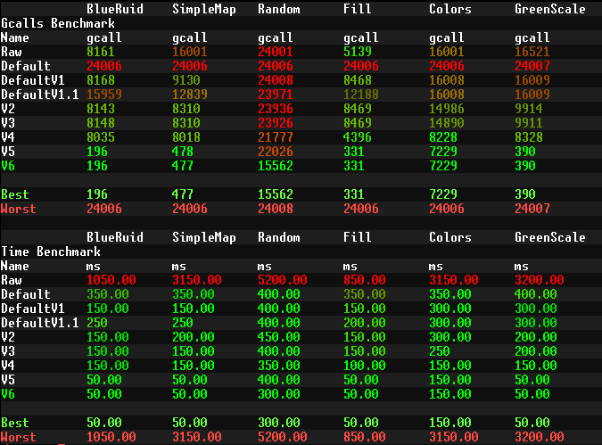

# OC-FastDraw
A OpenComputers lib to fast GPU drawing.<br>
To reach this, fdraw uses diverse methods to otimize the speed that a screen is rended, avoiding gpu calls, and using video ram buffers.<br>
#### Methods
Use setActiveBuffer to draw in apart buffer, and copy to screen buffer.<br>
Sorting the colors to avoid setForeground and setBackground redundants calls.<br>
Converts a rgb 24 bit, to a OC rgb 8 bit, the color 0xFF and 0xFE are the same, so is possible to avoid redundant calls.<br>
Uses an algorithm to find sections that can be drawn with fill instead of mutiples set calls.
# Consideration
Keep in mind that, fdraw is on development, probably your code will break in the fucture updates.
#### Bugs
Pixels that have been drawn multiple times with different colors do not respect the correct drawing order.<br>
Only have suport to draw one char, so you can't use fdraw.set to draw a string. **Will be implemented later**.
# Setup
Just download the lib folder, and paste in your opencomputers computer root.<br>
A wget version will be developed later.
# How use it
To use the FastDraw in your project, follow the code below.
```lua
  local fdraw = require("fdraw") --requires the fdraw lib

  --To draw with fdraw, a function needs to be created. Insted use the require"component".gpu.set to draw, we use the require"fdraw".set
  --The function can recive args, so you can easly customize the function to draw several things, instead of creating a function for each.
  --Some function names have been shortened, exemple setBackground is shortened to setb, setForeground to setf
  local function clear(color) --Recives a "color" as #1 arg.
    fdraw.setb(color) --use this color to set the background.
    for x=1, 80 do
      for y=1, 80 do
        fdraw.set(x,y, " ") --loops for all 80x80 pixel, and set then to " " char
      end
    end
  end

  local idx = fdraw.new(80, 80) --Create a new gpu and fdraw buffer with 80 x 80 size, the new function returns a index that refer to the new buffer created.
  fdraw.select(idx)  --Selects the idx as current work buffer.
  fdraw.draw(clear, 0xff00) --draw in the fdraw buffers, useing the "clear" function, and passing 0xff00 as #1 arg.
  fdraw.flush() --This function draw in the gpu buffer from the fdraw buffers, this is the function that really draw.
  fdraw.display() --Copy the gpu buffer, to the screen buffer.
  fdraw.free(idx) --Free the gpu and fdraw buffers. This is very important, if you forget that, memory leaks will occur.
  idx = nil --Only good practice, the idx now holds an index to a buffer that have been clean by the free function, so don't have any value for us.
```
# Results
This topic show the final result of fdraw otimization, the "Raw" benchmark is the raw use of set function. **Less points is better**.<br>

# Exemple

[CODE](./home/exemple.lua)
